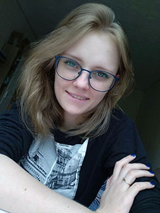
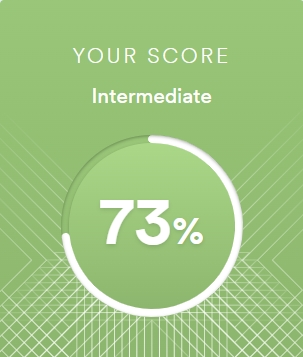

## Abanina Elena


### Junior Frontend Developer

## About me
I was born in Russia in 1995. I love math since childhood, that's why i went to study engineering after school. After my univercity education I couldn't find a job in my specialty. Then I decided to look for something that I like. After all I became a JS developer in a big company. I hope to gain experience in this course for my future development.

## Contacts
* Discord: Norseng#9007
* Email: helena.norseng@gmail.ru

## Skills
* HTML5, CSS3, Methodology BEM, pug&scss
* Bootstrap
* Git, Github, Bitbucket
* Gulp
* JavaScript ES6, JSON
* Jquery, Swiper.js, other Jquery libraries.
* Sublime, VS Code
* Adobe Photoshop, Figma, XMind

## Code (Kata)
```
function findUniq(arr) {
  arr = arr.sort();
  if (arr[1] === arr[0]) {
    return arr[arr.length - 1];
  } else {
    return arr[0];
  }
}
```

## Education and Courses
* Moscow State University of Instrument Engineering and Informatics
* [Teachline](https://teachline.ru/courses/kak-sozdat-sayt-samostoyatelno/)
* [1С-bithix](https://dev.1c-bitrix.ru/learning/)
* A lot of free youtube courses

## Projects
* [Infographics](https://itelon.ru/know/news/detail/v_rossii_ssd_zanimayut_vse_novye_rubezhi__no_polnoy_sdachi_pozitsiy_hdd_eshche_ne_predviditsya/)
* [elvizus.ru main page](https://elvizus.ru/)
* [elvizus.ru service page](https://elvizus.ru/%d1%85%d0%b8%d1%80%d1%83%d1%80%d0%b3%d0%b8%d1%8f-%d0%ba%d0%b0%d1%82%d0%b0%d1%80%d0%b0%d0%ba%d1%82%d1%8b/)
* [elvizus.ru service page](https://elvizus.ru/detskaya-oftalmologiya/)
* [elvizus.ru filial page](https://elvizus.ru/pavlovo-posadskij-filial/)
* [consilium-zheldor.ru main page](https://consilium-zheldor.ru/)
* [consilium-zheldor.ru specialists page](https://consilium-zheldor.ru/specialists/)
* [All Frontend | Landing Kinder Smile](https://star-smile.ru/kinder-smile/)
* [All Frontend | Landing Kinder Smile](https://doctor.star-smile.ru/kinder-smile/)
* [All Frontend | chikipooki.com](https://chikipooki.com/ru)
* [All Frontend | Site without CMS](https://dobro-men.ru/)
* [All Frontend | leonax.ru](https://www.leonax.ru/)

## Languages
* English Intermediate B1-B2 [efset.org](https://www.efset.org/) 


* Russian Native
